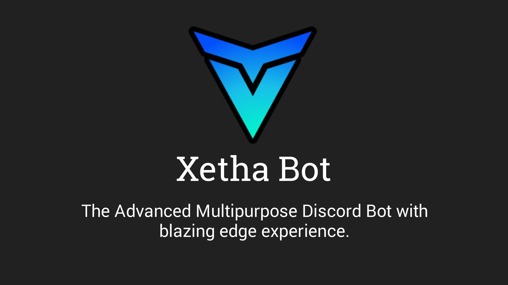

|      Codebase      |    Description     |
| :----------------: | :----------------: |
|  [athena](athena)  | React App Frontend |
|   [cathy](cathy)   |  Express Backend   |
| [xanatha](xanatha) |     Xetha Bot      |
|  [shared](shared)  |  Shared Libraries  |

